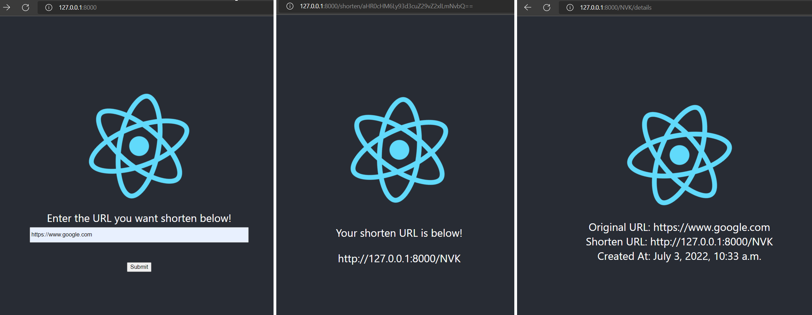

# Leaky URLs

An imperfect implementation of the TinyURL project that focuses more on demonstrating system design and specific technologies.

This project is bootstrap with `django-admin` and `create-react-app`.

# Quick Start

Ensure you have [pipenv](https://pypi.org/project/pipenv/) and [nvm](https://github.com/nvm-sh/nvm) installed, using the latest `python` and `node` versions from both frameworks.

At the root project directory, run the following commands:

```
# install dependencies
yarn

# migrate the database
yarn migrate

# run all tests
yarn test

# build the respective React apps
yarn build

# start Django
yarn start
```

Refer to `package.json` for the available commands.

# Table of Contents

1. [Quick Start](#Quick-Start)
2. [Architecture](#Architecture)
   - [User Interface](#User-Interface)
   - [Routes](#Routes)
   - [Algorithm](#Routes)
   - [Project Structure](#Project-Structure)
3. [Development](#Development)

# Architecture

Django will be used for the backend, and will be the primary component for the whole Web Application (WebApp). Its Object Relational Mapper (ORM) will be used to interface with SQLite and Postgres databases, while its templating engine with url schemas will be used to server-side render the WebApp. React will be the primary javascript library used to create interactive interfaces.

## User Interface



**Users** will navigate to the _Leaky URLs_ website and be shown a simple `input` box for them to enter their URL to shorten. After submitting the URL, users will be redirected to a new page that shows the shorten URL in a `textbox`. Users can then share these URLs to guide people to the specific website that they have chosen.

Every shorten URL also has an additional `/details` route that directs the **User** to a website showing statistics about the shorten URL.

**Admins** will have an authenticated website that they can view, which shows all the registered URLs and their corresponding shorten URLs. They have the permission to manually add or remove certain URLs as they deemed fit.

## Routes

```
/
/shorten/<str:encoded_url>
/<str:shorten_url>
/<str:shorten_url>/details
```

Dedicated React apps will be created for each route, with each project having its own `index.html` template. The React Apps will be bootstrapped with `create-react-app` and build with `react-scripts` and `react-snap` to generate pre-rendered HTML files. More details are listed in the project structure section below.

## Algorithm

The following constraints will be set:

- The shorten route can only contain characters from the set **[A-Z][a-z][0-9]**.
- The shorten route can only contain **3 characters**.
- There can only be a total of **238,328** shorten URLs. ((26 + 26 + 10) permuations of (3)).
- Once the database is full, the **oldest** shorten URL will be deleted.

Upon a new shorten URL request, the flow will be as follows:

1. If the maximum number of shorten URLs is already reached:
   1. Find the oldest shorten URL.
   2. Delete the entry.
   3. Create a new entry with the same route that was deleted.
   4. Return the shorten URL to the user.
2. Else, generate a random route using the constraints listed in the previous section.
3. If the route is already taken, increment the generated route by 1 character till an empty route is found.
4. Return the shorten URL to the user

The best-case _Time Complexity_ for creation of a shorten URL is _O(1)_, while the worst-case is _O(N)_, where _N_ is the number of permutations.

## Project Structure

```
leaky-urls/
    ...
    manage.py
    package.json
    leakyurls/
        __init.py__
        settings.py
        ...
    shortenurls/
        __init.py__
        urls.py
        views.py
        ...
        static/
            ...
            shorten/
                # React App static files
                ...
        templates/
            ...
            shorten/
                # React App pre-rendered HTML
                index.html
        pages/
            ...
            shorten/
                # React App
                ...
```

A modern _JAMStack_ WebApp would usually separate out the frontend code and rely on _REST APIs_ to create the full WebApp. However, as Django promotes Server-Side programming with templates, the following strategy will be taken. Every route will have a separate `index.html` template such that Django can inject specific data to it when specific users navigate to the route. As React is used to create interactive pages, the above project structure has been setup. Every React App will be part of the larger monorepo (_yarn workspaces_) managed by the root `package.json`. Upon triggering of the React build step (using `react-scripts` & `react-snap`), the pre-rendered `index.html` will be copied to the Django App specific templates folder, while the static assets will be copied to the corresponding static folder as well. These folders will be picked up by Django, by stating them in the `settings.py` file.

# Development

Ensure you have the dependencies listed in [Quick Start](#Quick-Start).

Within each of the respective React apps, devs may use `react-scripts` to develop locally without any need to interact with Django. As data is passed into the React apps using `window.django` objects, react devs can simply mock those objects and carry on with their development. It is recommended to adopt Test/Behavior Driven Development using `React Testing Library (RTL)` and `jest`.

## Test-Driven Development

Navigating to `src/__tests__` in the respective React Apps, one can see that the tests are written in a way that mimics the actual `User Story`. This acts as a contract between developers and the product owner as to what features have been completed, and will carry on to exist throughout the product lifecycle. With `RTL`, writing `User Story` tests that mimics actual user behavior is made possible, while also being able to execute as fast as how traditonal unit tests do.

As for testing Django, ideally unit tests should be written for each of the functions and integration tests written to test the routes. However, due to time constraints given for this project, it was left out.
